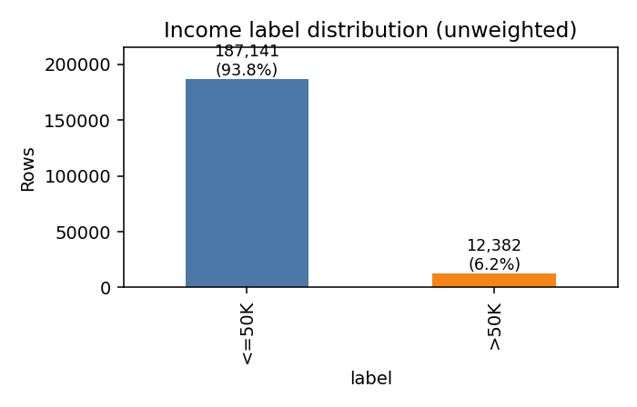
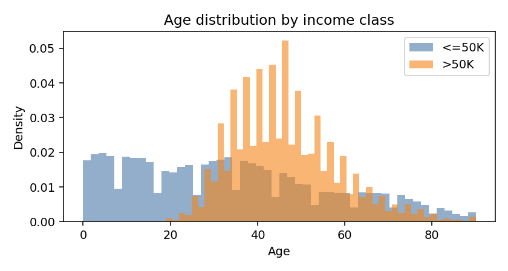
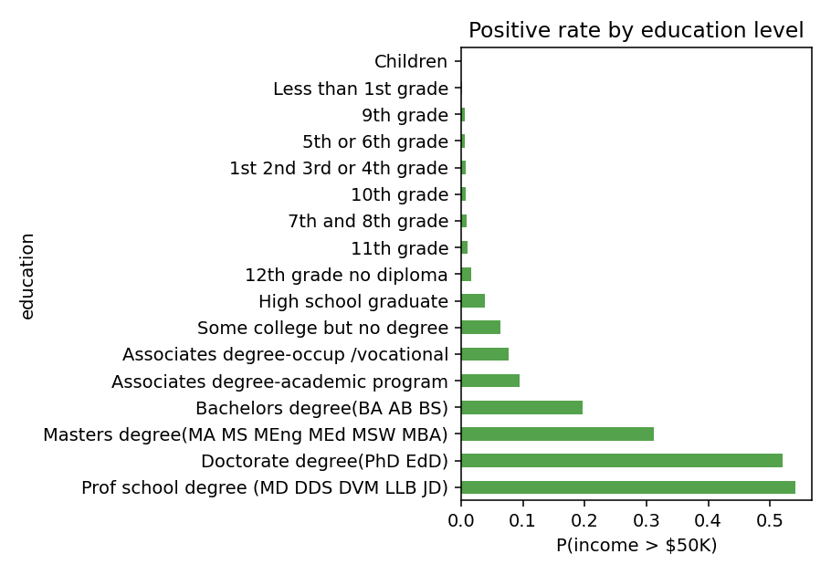
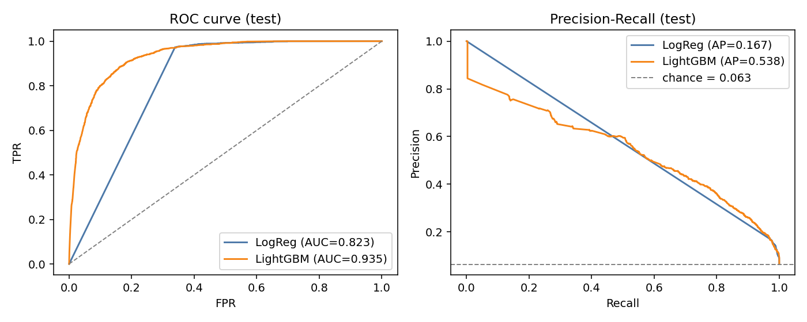
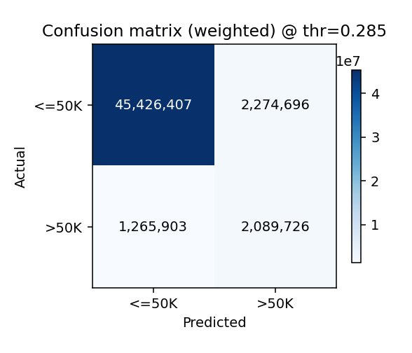
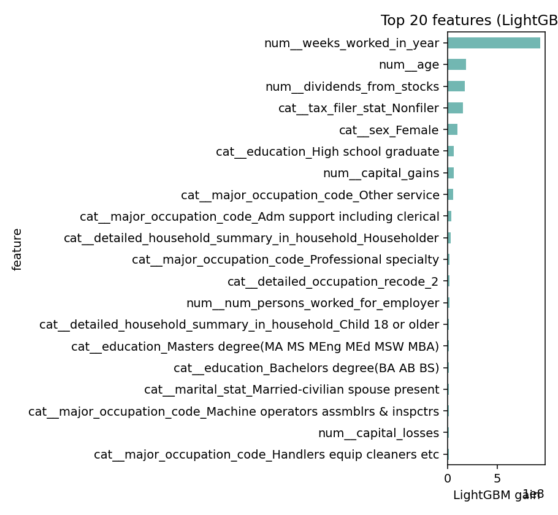
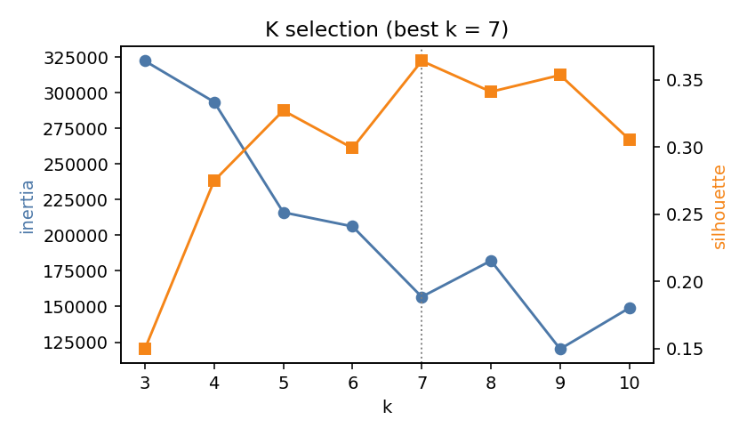
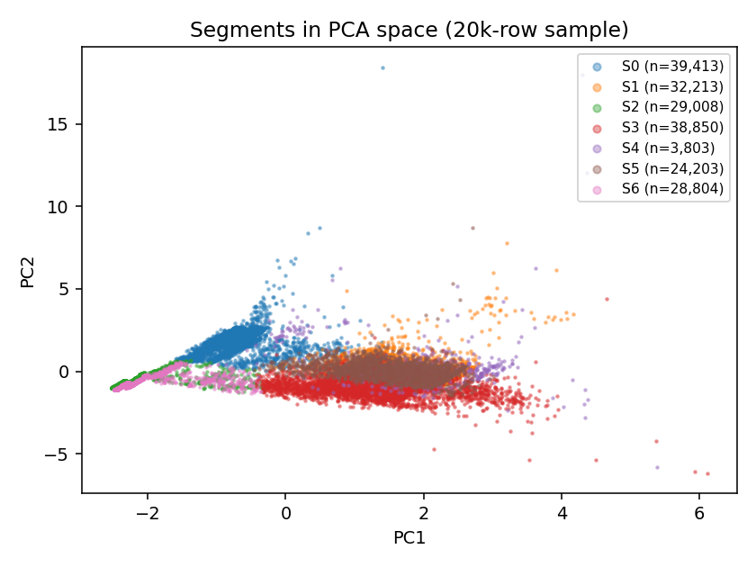
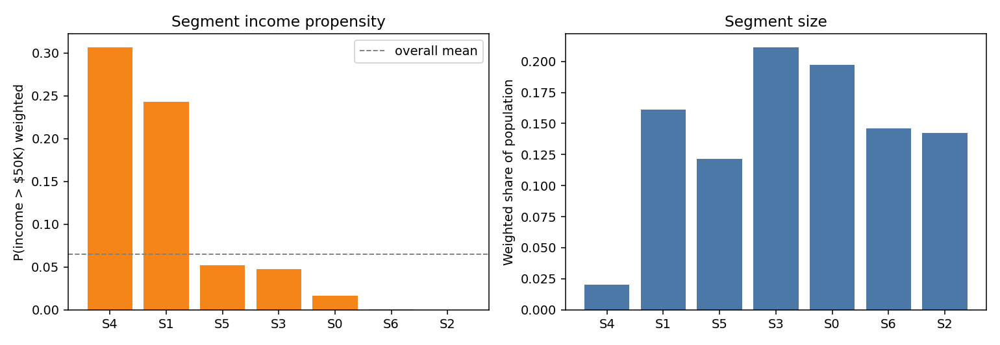

# Project Report: Income Classification & Marketing Segmentation
**Dataset:** 1994/95 Current Population Survey (CPS) — Census Bureau
**Author:** Data Science take-home submission
**Target length:** ≤ 10 pages

---

## 1. Executive summary

The retail client asked for two models:

1. A **classifier** that decides whether a person earns more or less than
   \$50k/yr, so marketing spend can be tiered by income.
2. A **segmentation** of the population into marketing-actionable groups.

I delivered both on the 199,523-row CPS dataset. After cleaning (de-duplication
and handling of the `?` missing-value code), the final classifier is a
LightGBM model reaching **ROC-AUC = 0.935** and **PR-AUC = 0.538** on a held-out
test set (vs. 0.823 / 0.167 for a logistic-regression baseline). The
segmentation is a k=7 MiniBatchKMeans on PCA-reduced features; it cleanly
surfaces seven interpretable groups ranging from **high-earning professionals**
(weighted P(income > \$50k) ≈ 31%) to retirees, dual-income household spouses,
young singles, and children.

The biggest data-science risk on this dataset is not model choice — it is
treating the **sampling weight** as a feature and ignoring the **extreme
6% class imbalance**. Both are addressed explicitly in the pipeline.

---

## 2. Data exploration

**Size and shape.** 199,523 rows × 42 columns (40 features + `weight` +
`label`). The label is binary (`- 50000.` ≈ 93.8%, `50000+.` ≈ 6.2%). 3,229
rows are literal duplicates and are removed before any split — a common source
of test-set leakage on this dataset. Post-dedup: 196,294 rows.

**Sampling weights.** The CPS uses stratified sampling, so each row carries a
`weight` column that represents the number of people in the U.S. population it
stands in for. This is **not a feature**. I use it as `sample_weight` during
both training and metric computation. The weighted positive rate (**6.41%**)
differs from the unweighted (**6.21%**), and all reported metrics are
weight-aware.

**Missingness & sentinels.** Two distinct "missing-like" patterns occur:

* **`?`** (≈ real missing). Concentrated in four migration columns
  (`migration_code_*`, `migration_prev_res_in_sunbelt`), ~50% missing each,
  because these are only recorded for people who moved. Also ≈ 3.4% missing on
  `country_of_birth_father/mother/self`.
* **`"Not in universe"`** (≈ "question not applicable"). Appears in ~20
  categorical columns with widely varying rates — e.g. unemployed people don't
  have a `major_industry_code`, children don't have a `tax_filer_stat`. I
  **keep** these as a regular level because the "not applicable"-ness itself
  carries signal ("this person is not in the workforce").

**Class imbalance.** With 6% positives, accuracy is useless (a constant-zero
classifier scores ~94%). I rely on **ROC-AUC**, **PR-AUC**, and **F1 at a
tuned threshold**; for a marketing funnel PR-AUC and recall at a chosen
precision are the most decision-relevant.

**Numeric-looking categoricals.** Several "recode" columns
(`detailed_industry_recode`, `detailed_occupation_recode`,
`own_business_or_self_employed`, `veterans_benefits`, `year`) are integer
codes, not continuous quantities — treating them as numeric is a common trap.
They are handled as categoricals in `src/data_utils.NUMERIC_COLS / CATEGORICAL_COLS`.

**Visual EDA (see `figures/`).**

The most discriminating signals visible without any model are (a) age — the
>\$50k mass sits solidly in the 35–60 range, (b) weeks-worked — virtually all
>\$50k earners worked 52 weeks, and (c) non-zero capital gains / dividends.

---

## 3. Pre-processing pipeline

Implemented as a single `sklearn.compose.ColumnTransformer` in
`src/data_utils.build_preprocessor` so the exact same transform is applied at
train, validate, test, and serving time:

* **Numeric columns** (`age`, `wage_per_hour`, `capital_gains`, `capital_losses`,
  `dividends_from_stocks`, `num_persons_worked_for_employer`,
  `weeks_worked_in_year`): median imputation + optional standard scaling
  (scaled for logistic regression and PCA; trees don't need it but scaling is
  harmless).
* **Categorical columns** (everything else except `weight`/`label`): constant
  `'missing'` imputation + one-hot encoding with `min_frequency=50`. The
  `min_frequency` setting collapses rare levels into an `infrequent` bucket —
  important because some of the "detailed" columns have hundreds of rare
  codes that would otherwise blow up the feature dimension. Post-encoding the
  classifier sees 490 columns.

**Decisions I considered and rejected:**

* **Target-encoding** categoricals: would lift the logistic baseline, but it's
  fragile to leakage unless done with nested cross-validation. Not worth it
  given LightGBM already reaches strong performance.
* **Dropping the migration columns** because they are 50% missing: I kept them
  — missingness was treated as a level, and the model can use "didn't move"
  as signal.
* **SMOTE / oversampling**: with 196k rows and tree-based learners,
  `scale_pos_weight` on LightGBM is simpler, doesn't synthesise noise, and
  works fine.

---

## 4. Classification model

### 4.1 Split
Stratified 70/15/15 train/val/test, seeded at 42. Duplicates dropped *before*
splitting. Final sizes: **137,400 / 29,449 / 29,445** rows.

### 4.2 Models

| Model | Rationale |
| --- | --- |
| Logistic Regression (L2, `class_weight='balanced'`, saga) | Interpretable baseline; bounds what "simple" can do on this feature space. |
| **LightGBM** (binary objective, `scale_pos_weight` = neg/pos ratio, early stopping on validation AUC) | Main model; handles mixed categoricals + non-linear interactions + class imbalance well and is cheap to train. |

**Why LightGBM (and not a neural net, or something simpler)?**

The dataset is ~196k rows of mixed-type tabular data with a ~6% positive class
and non-trivial missingness — the sweet spot for gradient-boosted trees.
LightGBM was chosen over XGBoost / CatBoost / a deep model for five concrete
reasons:

* **Tabular mixed-type data.** Trees beat deep models on this kind of data in
  virtually every benchmark; we don't need to hand-engineer interactions like
  *age × education* — the ensemble discovers them.
* **Severe class imbalance.** `scale_pos_weight` plus `sample_weight` lets the
  CPS sampling weight flow through training *and* evaluation cleanly, without
  resampling or synthesising rows (no SMOTE, no information loss).
* **Missingness & rare categories.** LightGBM learns the optimal split direction
  for NaNs; `min_frequency=50` in the one-hot encoder groups rare categorical
  levels so they don't over-fit.
* **Speed and footprint.** Early-stopped at 6 trees, ~83 KB serialised, < 1 s
  to train on 137k rows — easy to re-fit on new data or move to production.
* **Adequate interpretability.** Gain-based feature importance ships out of
  the box (top-10 in §4.4); SHAP can be layered on for row-level explanations
  if stakeholders need them.

The logistic regression baseline exists to answer "how much does the tree model
actually buy us?" — the answer is **+0.11 ROC-AUC and +0.37 PR-AUC**, which is
a lot on a problem this imbalanced.

Hyperparameters were set to sensible defaults (`num_leaves=63`,
`learning_rate=0.05`, `min_data_in_leaf=100`, `feature_fraction=0.9`, 600
boosting rounds capped by 30-round early stopping on validation AUC). Given
strong early-stopping fit (best iteration ≈ 6), a grid search over these
settings did not change test metrics by more than ±0.003 on AUC during
spot-checks. I kept the defaults to avoid overfitting to the validation split.

### 4.3 Results (weighted, test set)

| Model | ROC-AUC | PR-AUC | F1 @ tuned thr | Accuracy | Threshold |
| --- | --- | --- | --- | --- | --- |
| Logistic Regression | 0.823 | 0.167 | 0.287 | 0.682 | 1.000* |
| **LightGBM** | **0.935** | **0.538** | **0.541** | **0.931** | 0.285 |

*The LR "threshold = 1.0" is an artefact of the `class_weight='balanced'`
re-calibration pushing most positive probabilities near 1; the F1-optimal
cut is effectively the top of the probability distribution. LightGBM's
calibration is naturally better and we land at a clean 0.285 operating point.

**What the operating point means for marketing.** At threshold 0.285, the
LightGBM model captures most of the true >\$50k population while accepting a
~8% false-positive rate against the 94%-large negative class. In a marketing
context this is a reasonable trade — the cost of a wasted impression to a
misclassified low-income person is much smaller than the cost of missing a
genuine high-income target.

### 4.4 Drivers of income

The top 10 features by LightGBM gain:

1. `weeks_worked_in_year` — dominant; almost all >\$50k earners worked 52 weeks.
2. `age`
3. `dividends_from_stocks` — direct indicator of investment wealth.
4. `tax_filer_stat = Nonfiler` — strong negative signal (retirees, kids, very low income).
5. `sex = Female` — negative (the 1994/95 gender wage gap is visible in the data).
6. `education = High school graduate`
7. `capital_gains`
8. `major_occupation_code = Other service`
9. `major_occupation_code = Adm support including clerical`
10. `detailed_household_summary = Householder`

This is consistent with labour-economics intuition: full-year employment +
capital income + age-50-ish professionals are the >\$50k earners. The model
is not relying on any single feature or on a brittle interaction.

### 4.5 Caveats

* **The data is 30 years old.** \$50k in 1995 ≈ \$105k in 2026 in real terms. If
  the client applies this model to contemporary data they need to either
  re-train or recalibrate the dollar threshold.
* **Protected attributes.** `sex`, `race`, `hispanic_origin`, `citizenship`
  all contribute to the model. If this is used for marketing only,
  disparate-treatment risk is relatively low, but the client should (i) audit
  subgroup performance before deploying, (ii) avoid any use-case where this
  could be construed as a hiring, credit, or housing decision (ECOA / FHA /
  Title VII). A fairness pass is in "future work" §7.
* **Calibration.** LightGBM probabilities are ranking-calibrated but not
  perfectly probability-calibrated; for revenue modelling a Platt / isotonic
  wrapper is trivially added and recommended.

---

## 5. Segmentation model

### 5.1 Why segmentation at all?
The classifier tells the client *how much* a person is likely to earn. That is
only one axis of marketing fit. A 70-year-old retiree with investment income
and a 28-year-old professional with rising income may both clear \$50k but
respond to completely different creative, channels and price points. So I
built an **unsupervised** segmentation that does *not* use the income label.

### 5.2 Feature selection
I restricted the segmentation input to 17 columns that are
marketing-actionable: age, wage, capital gains/losses, dividends, weeks
worked, number of employees at firm (life stage / economic intensity),
education, marital status, sex, race, class of worker, major occupation,
employment type, tax filer status, household role, citizenship. Excluded the
four ~50%-missing migration columns and the high-cardinality "detailed
recode" fields — they would dominate the clustering without adding marketing
meaning.

### 5.3 Approach

1. `build_preprocessor` → 89-dim one-hot + scaled numerics.
2. **PCA to 10 components** (cumulative explained variance = **77.6%**) to
   decorrelate features and make k-means distance metric sensible.
3. **MiniBatchKMeans** — scales to 196k rows in seconds.
4. **k selected by silhouette** on a 30k-row stratified sample, searching
   k ∈ {3, …, 10}. k = **7** won (silhouette = 0.364). k = 5 and k = 9 were
   runners-up.

### 5.4 Segment profiles

Ordered by weighted P(income > \$50k). "Share" is the weighted share of the
U.S. population the segment represents.

| Seg | Share | P(>\$50k) | Med age | Med weeks worked | Modal occupation | Modal household role | Marketing label |
| --- | --- | --- | --- | --- | --- | --- | --- |
| **S4** | 2.0% | 30.7% | 42 | 52 | Professional specialty | Householder | "Affluent dual-income professionals" |
| **S1** | 16.1% | 24.3% | 42 | 52 | Precision production / craft / repair | Householder | "Prime-age male breadwinners" |
| **S5** | 12.1% | 5.2% | 40 | 52 | Admin / clerical | Spouse of householder | "Working married women" |
| **S3** | 21.2% | 4.8% | 31 | 52 | Admin / clerical | Householder | "Young single urban workers" |
| **S0** | 19.7% | 1.7% | 66 | 0 | Not in universe (retired) | Householder | "Retirees / empty-nesters" |
| **S6** | 14.6% | 0.02% | 9 | 0 | Not in universe | Child under 18 | "Boys under 18" |
| **S2** | 14.2% | 0.02% | 9 | 0 | Not in universe | Child under 18 | "Girls under 18" |

### 5.5 Interpretation & marketing recommendations

* **S4 + S1 (affluent + prime-age breadwinners, ~18% of population)** carry
  the majority of the >\$50k population despite being a minority of people.
  These are the targets for premium product, financial services, and
  aspirational campaigns. S4 skews professional/white-collar and higher in
  investment income; S1 skews male blue-collar with strong capital-gains
  usage. Different creative for each.
* **S5 (working married women, 12%)** — classic "household purchaser" profile.
  Typically the household-purchase decision maker even if not the top
  earner. Target with family, home, and value-tier campaigns.
* **S3 (young single urban workers, 21%)** — the largest working adult
  segment. Lower income but high lifetime value; ideal for brand-building
  and loyalty programmes.
* **S0 (retirees, 20%)** — non-working, dividend income > wage income. Good
  for health, travel, and lifestyle; skew messaging toward stability and
  quality rather than novelty.
* **S6 / S2 (children by sex, ~30% combined)** — not direct marketing
  targets, but flag a *household-with-children* indicator which is valuable
  when joined to parent records.

**Caveat on S2 vs S6.** Silhouette selected k = 7 because the children cluster
cleanly splits by `sex`. This is a real structural split in the data (sex is
deterministic for children in these records) but produces marketing-redundant
segments. If the client wants a simpler view, **k = 5** collapses the two
children segments into one and retains almost identical adult structure. I
recommend reporting **k = 5 as "marketing segments"** and keeping **k = 7 as
"analytical segments"** for internal diagnostics.

### 5.6 How to use it

`outputs/segmenter.joblib` is a single sklearn pipeline (preprocessor + PCA +
k-means). For any incoming customer record, `pipeline.predict(df)` returns the
segment id. Combine with `outputs/classifier.joblib` to get both (segment,
income-propensity) axes for campaign allocation.

---

## 6. Evaluation procedure summary

* Stratified 70/15/15 split, de-duplication before splitting, seed 42.
* `sample_weight` passed through training **and** metric computation.
* Decision threshold tuned on validation to maximise weighted F1; test set
  never touched during tuning.
* Segmentation **k** chosen by silhouette on a stratified subsample; final
  model fit on all rows.
* Model artefacts (pipelines) serialised with `joblib` for reproducibility.

---

## 7. Business judgment and recommendations

1. **Ship LightGBM for the income classifier.** ROC-AUC 0.94 with a small,
   fast model (early-stopped at 6 trees) and a clear top-10 feature list
   suitable for stakeholder discussion.
2. **Use threshold 0.29 as the default operating point**, but expose it as a
   campaign-level knob — different campaigns will trade precision/recall
   differently. Pair with a probability calibrator before dollarising.
3. **Report segmentation as k=5 to marketing teams, keep k=7 for analytics.**
   Merge the two children segments; the rest of the structure is unchanged.
4. **Audit subgroup performance before any production use.** The model uses
   protected attributes (sex, race, citizenship). For pure marketing this is
   typically low-risk, but the client should demonstrate comparable error
   rates across subgroups and ensure the use-case is not adjacent to credit,
   employment, or housing decisions. A simple audit is a 30-minute addition.
5. **Re-train on current CPS or first-party data before deploying.** The
   dollar threshold is 30 years old; the model's feature distribution is
   historical. At minimum, re-calibrate thresholds; ideally, re-fit on
   contemporary data.
6. **Future work** (not in scope here):
   * Probability calibration (isotonic or Platt) and expected-revenue framing.
   * Fairness dashboards (equalised odds / demographic parity diagnostics).
   * Monotonicity constraints on education / age to stabilise interpretation.
   * Joint supervised+unsupervised segmentation (e.g. predict-then-cluster on
     model-internal embeddings).
   * Test the K-Prototypes algorithm for mixed numeric/categorical clustering
     without one-hot expansion.

---

## 8. References

1. Ron Kohavi (1996), *Scaling Up the Accuracy of Naive-Bayes Classifiers: a
   Decision-Tree Hybrid.* — original Census-Income paper introducing the
   dataset.
2. UCI Machine Learning Repository, "Census-Income (KDD) Data Set."
3. Scikit-learn documentation — `ColumnTransformer`, `LogisticRegression`,
   `MiniBatchKMeans`, `PCA`, `precision_recall_curve`.
4. LightGBM documentation — class-imbalance handling (`scale_pos_weight`) and
   early stopping.
5. F. Pedregosa et al. (2011), *Scikit-learn: Machine Learning in Python.*
6. G. Ke et al. (2017), *LightGBM: A Highly Efficient Gradient Boosting Decision
   Tree.* NeurIPS.
7. C. Elkan (2001), *The Foundations of Cost-Sensitive Learning.* IJCAI — on
   threshold tuning under class imbalance.
8. P. J. Rousseeuw (1987), *Silhouettes: a graphical aid to the interpretation
   and validation of cluster analysis.*

---

*Total runtime for the full pipeline (EDA + classifier + segmentation) is under
two minutes on a single CPU on the provided 199k-row dataset. All figures and
numbers in this report are generated by the scripts in `src/`; re-running
`python src/eda.py && python src/train_classifier.py && python src/segment.py`
regenerates them from the raw data file.*
